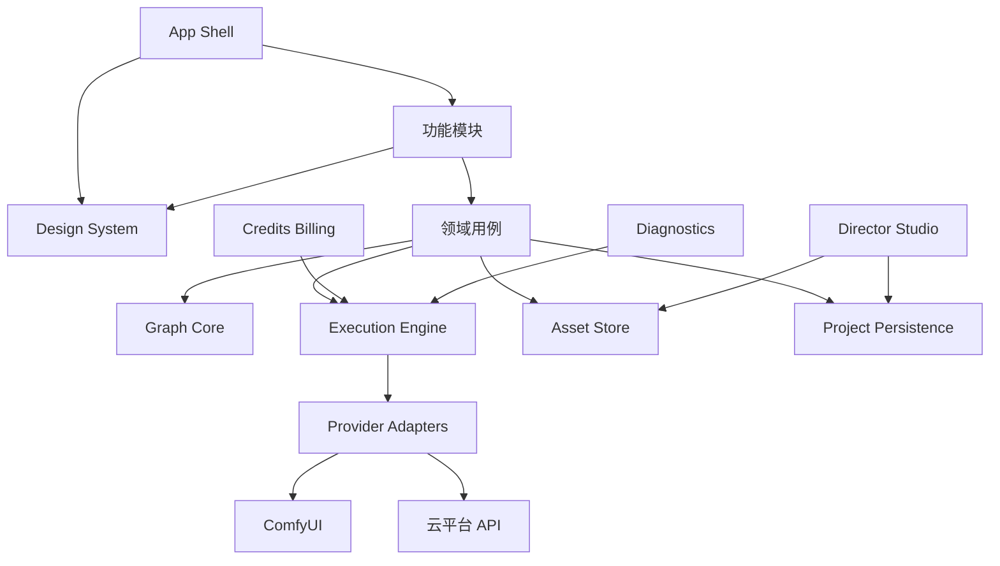
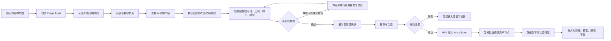
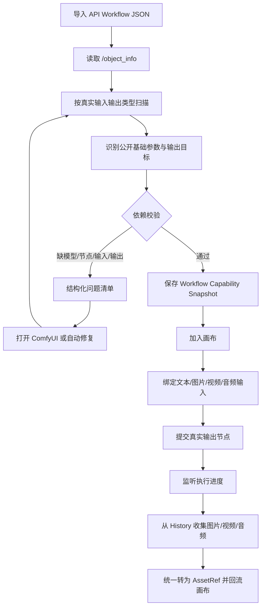
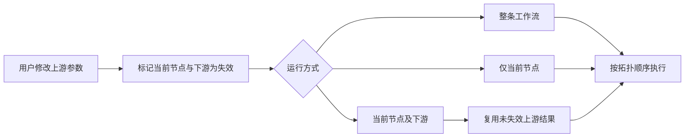

# 亿幕画布产品重构与验收基线

> 文档状态：重构基线，非完成说明
> 最近审计：2026-08-19
> 适用仓库：`D:\Codex\ComfyCanvas-workspace`
> 核心目标：将当前程序重构为可长期开发、模块互不干扰、能真实完成“剧本 → 分镜 → 图片 → 视频 → 剪辑 → 导出”的桌面创作工具。

本文件描述的是**目标架构、风险和验收门槛**，不是“当前所有功能已经完成”的声明。当前代码实际已具备的能力、逐步操作、可复现验收和明确限制，请以 [操作与验收指南](./操作与验收指南.md) 为准。两份文档的分工如下：

- 本文：为什么要重构、模块不得如何耦合、最终怎样才算可交付；
- `操作与验收指南.md`：现在能做什么、需要什么外部环境、怎样操作和怎样判断失败。

## 1. 本文档如何使用

本文档同时承担产品规格、模块边界和交付验收三种职责。任何新功能、界面改版或平台适配，在开始编码前必须确认：

1. 功能属于哪个模块；
2. 只通过什么公开接口与其他模块通信；
3. 会影响哪些已有用户流程；
4. 需要补哪些自动化测试；
5. 失败、断网、取消、重启后如何恢复；
6. 是否满足本文件末尾的交付门槛。

状态词统一如下：

- **已完成**：真实运行、异常路径、持久化和回归测试均通过。
- **部分完成**：已有界面或代码骨架，但至少有一条关键链路未被可靠验证。
- **未完成**：不存在，或只有不可交付的占位实现。
- **需核验**：代码看似存在，但尚无自动化证据或真实端到端记录。

禁止用“页面能打开”“按钮能点击”“有一段实现代码”代替“已完成”。

### 2026-08-19 桌面验收基线

本轮已经形成一组可复查的真实 Tauri 桌面证据，后续重构不得使这些能力回退：

- `26,458 B` 小图、`6,220,854 B` 大图、`901,652 B` MP4、`264,678 B` WAV 均成功写入项目受管目录；
- 验收发现 Windows 对已设为只读的目标文件调用 `sync_all` 会返回 `os error 5`，提交顺序已修复为“同步完成后再设置只读”；
- 完全重启后，图片 `naturalWidth > 0`，视频和音频 `readyState = 4` 且无媒体错误；视频 `loop = false` 并可暂停；
- 导演台直接导入的独立素材可以在重启后恢复；
- 从“打开项目”入口导入 ComfyUI 编辑器 UI JSON 会被拒绝，且拒绝后当前项目不变；
- 从“导入 API 工作流”入口选择编辑器 UI JSON 同样会被拒绝，不会生成无法运行的假 API 节点；
- 对正式备份副本执行显式旧媒体迁移，序列化内容从 `1,806,067` 个字符降到 `13,359` 个字符，重启后恢复；正式项目随后已迁移到 schema `v2`，当前为 `13,337` 个字符且不含 `data:` 媒体；
- 当前项目与一个旧历史项目均已写入独立 v2 文档，读回索引和文档成功后才删除旧 current/history 键；
- 迁移前原始备份为 `D:\Codex\ComfyCanvas-backups\深夜剧场-第三幕-20260819-100814.json`，SHA-256 为 `16450B50751283767AA807CC15B2858DD939B2C4682C87154831947C65611138`。

这组证据只覆盖桌面素材、项目迁移、媒体控件与重启恢复。**尚未使用真实 ComfyUI 服务或真实在线平台 API Key 完成生成 E2E**；模型上传、生成队列、轮询、取消、计费和输出回流仍是明确的待验收项。

---

## 2. 产品基准与可借鉴模式

### 2.1 LibTV：以成片为目标组织整个画布

LibTV 的官方定位不是单个生成器，而是覆盖“剧本、角色、世界观、无限画布、工作流、剪辑”的专业视频创作链路，并让 Agent 参与工作流。亿幕画布应借鉴其“每一步成为下一步输入”的产品逻辑，而不是只在画布上并排放几个生成按钮。

- 官方基准：[LibTV｜专业视频创作工具](https://www.liblib.tv/wappro?sourceid=040004)
- 可借鉴：剧本、角色、场景、分镜、图像、视频、音频、剪辑属于同一个项目上下文。
- 可借鉴：模型和 Skill 是完成创作的能力，不应成为一级信息架构的中心。
- 不应照搬：底层工作流尚不稳定时堆大量 Agent Skill 和模型入口。

### 2.2 Lovart：直接操作画布对象，而不是反复打开大弹窗

Lovart 采用选择工具、手形工具、情境工具栏、图层、历史和小地图；选中图片后即可编辑、局部修改或转视频。对象先被选中，操作才出现，避免所有控制同时占据屏幕。

- 官方基准：[Customize Your Canvas](https://www.lovart.ai/docs/edit-your-design/customize-your-canvas)
- 官方流程：[Design Your First Project](https://www.lovart.ai/docs/getting-started/design-your-first-project)
- 可借鉴：`V` 选择、`H`/空格平移，选择和导航互不抢事件。
- 可借鉴：选中素材后出现精简工具条；完整参数进入固定检查器。
- 可借鉴：图层、对象历史、生成文件和小地图是大型画布的基础能力。
- 不应照搬：不能将 Agent 作为唯一入口；用户仍需看见并修正节点、引用和参数。

### 2.3 Krea：透明模型选择与“计划—校验—执行”

Krea 的模型选择明确展示成本、速度和用途；次要控制按需隐藏。其 Node Agent 会先读取当前画布、展示计划、校验参数和类型、列出逐节点费用，再经用户确认运行；修改上游时只重跑受影响的下游。

- 官方基准：[Krea Redesign](https://www.krea.ai/blog/redesign)
- 官方基准：[The Node Agent](https://www.krea.ai/blog/ai-workflow-agent)
- 官方基准：[Prompt-to-Workflow](https://www.krea.ai/blog/prompt-to-workflow)
- 可借鉴：模型卡展示“适合什么、支持哪些输入、速度、预计费用”。
- 可借鉴：运行前计划、校验和费用确认。
- 可借鉴：下游失效与增量重跑，而不是每次重跑整张图。
- 不应照搬：在执行引擎未稳定前做全自动 Agent；Agent 应是稳定用例层的调用者。

### 2.4 FLORA：类型明确的多模态积木

FLORA 将文本、图片、视频、音频定义为可组合节点，并进一步提供可复用参考 Elements、Batch、Router、Action 和 Layer Editor。高级能力仍是独立积木，不侵入普通生成节点。

- 官方基准：[The AI Canvas for Image, Video & Audio](https://flora.ai/product-canvas)
- 官方基准：[Techniques, Text Layers & Router Node](https://flora.ai/updates/techniques-text-layers-router-node)
- 官方基准：[Elements, @ Mentions, & More](https://flora.ai/updates/elements-mentions-more)
- 可借鉴：角色、产品、风格成为可复用引用资产，而不是复制粘贴提示词。
- 可借鉴：Batch、Router、编辑动作作为独立节点。
- 可借鉴：`@` 引用自动建立真实依赖关系。
- 不应照搬：无治理地扩充节点数量；必须先有稳定节点注册协议和兼容矩阵。

### 2.5 Freepik Spaces：兼容节点搜索、运行范围和节点历史

Freepik Spaces 在用户从输出端拖到空白处时，只显示输入类型兼容的节点；节点搜索项包含用途、能力和费用说明。它区分运行单节点、整条工作流和仅下游，并为节点提供明确任务状态和历史结果。

- 官方基准：[Getting Started with Spaces](https://www.freepik.com/ai/docs/getting-started-with-spaces)
- 官方基准：[Nodes and Connectors](https://www.freepik.com/ai/docs/nodes-and-connectors)
- 可借鉴：端口拖出后自动过滤兼容节点。
- 可借鉴：Run Node / Run Workflow / Run Downstream。
- 可借鉴：结果直接显示在节点，历史结果可切换。
- 可借鉴：自动保存、小地图、命令面板和统一快捷键。
- 不应照搬：不能只靠端口颜色传达类型；还需文字、图标和无障碍说明。

### 2.6 ComfyUI：强类型、子图与创作/高级双层模式

ComfyUI 的真实数据类型用于阻止错误连接；子图可将复杂节点组封装为可复用单节点；App Mode 只暴露挑选后的输入和输出，普通用户不必看到采样器、CFG、VAE 等内部参数；模板还会检查缺失模型。

- 官方基准：[Datatypes](https://docs.comfy.org/custom-nodes/backend/datatypes)
- 官方基准：[子图](https://docs.comfy.org/zh/interface/features/subgraph)
- 官方基准：[APP 模式](https://docs.comfy.org/zh/interface/app-mode)
- 官方基准：[Workflow Templates](https://docs.comfy.org/interface/features/template)
- 可借鉴：端口按真实 `INPUT_TYPES` / `RETURN_TYPES` 匹配，不按节点名称猜测。
- 可借鉴：复杂工作流封装为子图，对外只暴露基础创作参数。
- 可借鉴：导入即扫描缺模型、缺节点、断线和输出节点。
- 不应照搬：不得将 ComfyUI 原始节点复杂度直接暴露在创作页，也不得写死节点 ID。

---

## 3. 当前仓库审计与已知问题

### 3.1 已存在但仍不完整的基础

当前仓库已经出现以下正确方向的骨架：

- `src/core/graph/types.ts`：定义了端口类型、连接和校验问题。
- `src/core/nodes/types.ts` 与 `registry.ts`：定义了节点声明和注册表。
- `src/core/execution/types.ts`：定义了统一执行请求、任务和 Adapter 接口。
- `src/core/providers/types.ts`：定义了平台和模型能力。
- `src/core/project/types.ts` 与 `migrate.ts`：定义了项目结构和 schema v2 迁移。
- 已有少量 `*.test.ts` 覆盖端口兼容、节点注册和项目迁移。

其中的实现状态必须按当前版本重新区分，不能将下面的重构建议误读为“尚未有任何实现”：

- `graph-core` 已有真实端口类型、兼容端口推断、新连线校验、环路/重复/单输入占用校验，以及旧连线的保守升级逻辑；
- `project-persistence` 已有按项目拆分的本机存储、旧项目迁移、项目命令和对应单元测试；
- 本轮项目仓库已将“活动文档 → 活动指针/小索引 → 超限旧文档清理”设为安全顺序；切换项目会先同步保存，保存失败则不切换，旧项目的延迟保存不会覆盖新活动项目；
- `execution/runRegistry` 已提供项目/节点/运行三元 token：快速重跑、切换项目、删除节点和停止后，旧的异步结果不再有权写回新的项目或节点；这只是客户端状态保护，真实服务端取消、计费与轮询仍需 E2E；
- `execution-plan` 已能独立计算单节点、下游或整条工作流的依赖、可执行顺序、循环、缺输入及上游阻塞；运行 UI 仍需逐步改为消费这份计划，不能再在组件内各自猜测依赖；
- 项目导出会附带可携带性快照；导入时会重新校验画布媒体、工作流库、提示词库和导演台引用，并在写入前明确提示需要重新绑定或已缺失的依赖；
- ComfyUI 工作流会在运行前读取当前 `/object_info`，按真实输入/输出插槽诊断缺必需输入、断线和类型不匹配，并只把真实媒体输出节点作为回流目标；
- 图片/视频能力表已用于限制部分模型—参数组合，避免向当前 Rust Adapter 传入会被丢弃的参数；
- 桌面端已新增受管素材仓储：画布、AI 参考与导演台的桌面导入可分块写入应用专属 AppLocalData，项目状态仅保留小型引用；导演台会将 Data URL / Blob URL 从持久化内容中剥离，并在无法持久化时展示恢复提示；无素材保持 5 秒空轨，有素材则按三类轨道最晚结束位置延长；右侧素材架独立滚动；竖屏预览以 9:16 舞台和真实媒体尺寸为准。同机真实 Tauri 写入、重启恢复、导演台独立素材恢复和显式旧媒体迁移已经通过；跨电脑和真实 ComfyUI 上传仍未验收；
- 图片与视频 Adapter 已将能力表实际接到提交前规范化/校验：OpenAI/Gemini 图片的尺寸、质量和参考限制，及万相/可灵/豆包的视频模式、图片数量和请求合同均不再只停留在 UI 文案；真实 API 账号的响应、计费和结果回流仍需 E2E；
- `package.json` 已提供 `npm.cmd run test`（Vitest）和 `npm.cmd run build`。

以下仍只能标记为 **部分完成**：

- `node-registry` 尚未接入主应用节点创建和渲染流程。
- `ExecutionAdapter` 尚未成为所有 ComfyUI/云平台运行的统一入口。
- `canConnectPortKinds` 尚未成为所有连线创建的唯一守卫。
- 当前自动化测试仍集中于纯函数、迁移和能力表；已经补充一次人工真实桌面窗口验收，但尚未形成覆盖真实 ComfyUI 和真实云端账户的完整端到端回归保障。

### 3.2 高耦合热点

2026-08-18 文件规模审计：

- `src/App.tsx` 约 260 KB。
- `src/app.css` 约 275 KB。
- `src/DirectorMode.tsx` 约 120 KB。

这三个文件同时承担大量状态、业务、绘制、弹窗、节点行为和视觉规则，是“改一个地方、另一个地方出错”的主要风险源。必须逐步拆分，不能继续在其中叠加新功能。

### 3.3 当前问题清单

以下问题在完成真实回归前一律视为 **尚未完成**：

#### 桌面启动与运行环境

- 调试 EXE 依赖 Vite 开发地址，直接打开曾出现 `127.0.0.1` 拒绝连接。
- 开发启动、便携启动和正式安装包的职责不清晰。
- 缺少启动前的前端服务、ComfyUI 服务、端口占用和版本检查。

#### 画布核心

- 画布拖动、节点拖动、视频控件、文本输入之间曾多次抢占事件。
- 连线仍有“看起来连上，但输入没有真正传递”的历史问题。
- 大量节点时缺少已验证的自动整理、分组、小地图和性能基线。
- 节点输出端口与输入端口没有完全以真实类型和插槽身份工作。

#### ComfyUI 工作流

- 真实类型扫描、默认值识别、输出节点识别仍需完整回归。
- 曾将带默认值的 `Ollama Options.stop` 误判为缺少必填输入。
- 曾出现工作流只执行 Preview 节点，没有执行真正视频输出节点。
- 缺模型、缺自定义节点、断开输出、类型错误的提示仍需统一结构。
- 工作流更新后重新扫描、旧 nodeId 失效和子图场景尚未形成测试证据。

#### 生成节点

- AI 剧本、AI 图片、AI 视频的视觉形态经过多次局部修改，但内部参数和真实能力仍可能不一致。
- 平台、模型、生成模式之间需要由能力表自动约束。
- 参考图、首帧、尾帧、多图参考和 `@图片` 的真实数据传递需分别测试。
- 生成结果必须作为独立资产节点回流，不能只替换生成器卡片内部状态。

#### 素材与历史

- 需要统一 AssetRef，避免 base64、文件路径、临时 URL、云端 URL 在组件中各自处理。
- 生成历史、节点历史、项目素材库、导演台素材之间尚未证明使用同一份资产事实源。
- 文件删除、项目迁移、临时 URL 过期和缩略图失败缺少完整策略。

#### 导演台

- 素材多时滚动和布局曾改变主预览区域尺寸。
- 9:16 预览、无素材时间线、拖放位置、播放头和轨道边界曾出现异常。
- 视频暂停、循环、裁切、音视频轨、字幕和最终导出需要端到端验证。
- `DirectorMode.tsx` 仍是大型单文件，后续修改风险高。

#### 视觉系统

- `app.css` 仍是单体样式文件，主题色、按钮、弹窗、状态色可能被局部选择器覆盖。
- 缺少真正独立的设计 Token、基础组件和模块样式边界。
- 不能把“整体换色”视为完成 UI 重构。

#### 质量保障

- 尚无可执行的统一测试命令。
- 尚无关键流程 E2E 测试。
- 尚无平台 Adapter 契约测试。
- 尚无大型画布性能测试、崩溃恢复测试和旧项目迁移夹具。

---

## 4. 目标模块边界

### 4.1 `app-shell`

职责：窗口级布局、路由、项目切换、全局命令、错误边界。
不得承担：节点业务、平台 API、时间线算法、文件解码。

### 4.2 `design-system`

职责：颜色、字体、间距、圆角、阴影、层级、按钮、输入框、菜单、弹窗、Tooltip、Toast、状态标识。
不得承担：任何项目状态或生成逻辑。

建议目录：

```text
src/ui/
├─ tokens.css
├─ primitives/
├─ feedback/
└─ icons/
```

### 4.3 `canvas-core`

职责：世界坐标、视口、缩放、平移、选择、框选、节点变换、对齐、吸附、分组、小地图、连线交互。
不得承担：生成 API、模型目录、积分、文件上传。

对外只输出语义事件，例如：

```ts
nodeMoved(nodeId, position)
connectionRequested(fromPort, toPort)
selectionChanged(nodeIds)
viewportChanged(view)
```

### 4.4 `graph-core`

职责：节点图、端口类型、连接规则、拓扑排序、环检测、必需输入、下游失效、运行范围计算。
不得依赖 React、Tauri 或任何平台 SDK。

唯一连接判断必须来自端口契约，不能在组件中写 `if (node.kind === ...)` 猜测。

### 4.5 `node-registry`

职责：注册节点定义、版本、输入输出、基础控制、高级控制、渲染器标识和执行用例标识。
不得在注册表中保存项目实例状态。

所有节点必须使用统一定义：

```ts
interface NodeDefinition {
  type: string;
  version: number;
  label: string;
  description: string;
  inputs: PortSpec[];
  outputs: PortSpec[];
  basicControls: ControlSpec[];
  advancedControls: ControlSpec[];
}
```

### 4.6 `execution-engine`

职责：运行前校验、费用估算、排队、进度、暂停/取消、重试、缓存、增量重跑、结果收集。
不得渲染 UI，也不得知道节点在画布上的坐标。

统一任务状态：

```text
idle → validating → queued → running
                           ├→ completed
                           ├→ failed → retrying
                           └→ cancelling → cancelled
```

### 4.7 `provider-adapters`

职责：将统一执行请求映射为 ComfyUI、可灵、豆包、Liblib、MJ/Nano Banana 等平台协议。
每个平台独立目录，不允许跨 Adapter 调用。

```text
src/providers/
├─ comfyui/
├─ kling/
├─ volcengine/
├─ liblib/
└─ custom-openai-compatible/
```

每个 Adapter 必须实现：能力发现、连接测试、校验、费用估算、提交、轮询/事件、取消、结果收集。

### 4.8 `asset-store`

职责：统一管理文本、图片、视频、音频资产及缩略图、来源、尺寸、时长、持久地址和引用关系。
导演台、画布、历史和工作流只传 `assetId` / `AssetRef`，不得各自复制文件逻辑。

当前实现已经有一个受限的桌面落盘边界：`workspaceAssetClient` 通过 Tauri 命令把文件分块写入 `app_local_data_dir()/workspace-v1`，并将 `assetId` / 元数据 / 本机路径回传给调用方。该边界已通过真实 Tauri 大/小图片、视频、音频写入及重启恢复；用户也可在备份后显式把可解码的旧 `data:` 媒体迁移到受管目录，迁移不会在打开项目时自动发生。它解决的是“不要把大文件直接写进 Web 存储”，**不是**完整 Asset Store：仍未提供跨电脑二进制打包、云同步、完整回收站或统一的跨模块资产事实源。浏览器预览模式只能使用受限的小文件回退；导演台外部浏览器导入仅本次会话。所有这些限制必须继续保留在产品文案和验收清单中。

### 4.9 `workflow-library`

职责：导入、导出、扫描、版本、模板、子图、App 模式、原始 ComfyUI 模式。
导入后必须生成能力清单、公开参数、缺失依赖和输出目标，保存时不得只保存旧 nodeId 推断结果。

### 4.10 `generation-features`

拆为 AI 文本、AI 图片、AI 视频三个独立功能包。每包只负责自己的编辑器、参数映射和节点渲染，通过 `execution-engine` 运行。

普通创作页只保留：提示词、参考素材、用途/模式、比例、时长/数量、模型预设。
采样器、CFG、种子、VAE、内部节点进入高级设置或工作流编辑器。

### 4.11 `director-studio`

职责：剧本/分镜导入、素材架、预览监视器、时间线、轨道、裁切、转场、字幕、音频、导出。
只消费 `AssetRef`，不读取生成节点内部状态；导演台故障不得阻断画布生成。

### 4.12 `project-persistence`

职责：项目仓库、自动保存、显式保存、历史快照、schema 迁移、崩溃恢复。
迁移函数必须纯函数、幂等、有固定夹具测试；旧项目必须保留原始备份直到新版本保存成功。

### 4.13 `credits-billing`

职责：费用估算、用户确认、积分余额、消费记录、退款/失败回滚。
只监听任务，不得控制节点渲染或平台选择。

### 4.14 `diagnostics`

职责：结构化日志、用户错误、开发诊断包、服务健康状态。
用户错误必须包含：发生位置、原因、影响、可执行修复按钮；技术堆栈只放进可展开详情。

---

## 5. 依赖规则与改动隔离



强制规则：

1. 依赖只能按图中箭头方向发生，底层不得反向导入 UI。
2. `features/*` 不得直接互相导入内部文件；跨功能只使用公共用例或事件。
3. React 组件不得直接 `invoke` Tauri 或 `fetch` 平台 API。
4. Provider Adapter 不得包含 JSX、CSS 或画布坐标。
5. Director Studio 不得读取生成节点局部 state。
6. CSS 模块默认局部作用域；全局样式仅允许 Token、Reset 和 App Shell。
7. 不完整的新模块必须由 Feature Flag 隐藏，不能以不可用按钮暴露给用户。
8. 每个跨模块接口带版本；项目数据只能通过迁移升级，不能原地猜测。
9. 删除或更名公开契约前，必须先提供兼容层和迁移测试。

---

## 6. 主界面功能区

### 6.1 顶部项目栏

包含：项目名、保存状态、撤销/重做、当前运行任务、ComfyUI/云端健康状态、积分、导出、设置。
不包含：节点参数和素材编辑。

### 6.2 左侧资源栏

固定入口：

- 创建：文本、剧本/分镜、图片、视频、音频、AI 文本、AI 图片、AI 视频。
- 素材：项目素材、生成历史、收藏引用。
- 工作流：本地工作流、模板、导入 API 工作流、ComfyUI App。
- 导演台：进入独立剪辑工作区。

应支持搜索、分类和用途 Tooltip；从端口拖到空白处时只显示兼容项。

### 6.3 中央无限画布

基础操作：平移、缩放、适配视图、选择、框选、多选、拖动、缩放节点、锁定、复制、删除、分组、自动整理、小地图。
画布对象只呈现必要内容；选中后才显示情境工具栏。

### 6.4 右侧属性检查器

根据当前选择切换：

- 未选择：项目与画布设置。
- 单节点：基础参数、输入输出、模型用途、费用、节点历史。
- 多节点：对齐、分布、分组、批量运行。
- 连线：来源、目标、数据类型、删除/替换。
- 错误节点：问题清单、定位、自动修复建议。

高级参数折叠展示；不得用遮挡画布的大弹窗作为日常编辑入口。

### 6.5 底部任务托盘

显示所有生成任务的排队、运行、进度、费用、耗时、取消、失败和重试。关闭节点或切换项目后，任务状态仍应可追踪。

### 6.6 节点卡片

统一结构：

```text
标题 / 类型 / 状态
输入端口                      输出端口
核心内容或结果预览
基础操作：运行、历史、放大
错误或费用摘要
```

图片、视频、音频播放器必须在不阻断节点选择和拖动的情况下工作；拖动标题区移动节点，媒体区只处理播放/暂停/进度。

### 6.7 导演台

固定为四区：

1. 左侧脚本/导演笔记；
2. 中央预览监视器，严格保持所选 9:16、16:9、1:1 画幅；
3. 右侧可滚动素材架，不得挤压监视器；
4. 底部时间线，多轨道、播放头、缩放、吸附、裁切和导出。

---

## 7. 主操作流程

### 7.1 从参考图生成视频并进入导演台



### 7.2 ComfyUI 工作流运行



### 7.3 运行范围



---

## 8. P0–P3 路线

### P0：救援与稳定化

目标：恢复一个可开发、可启动、可保存、三条主链可真实运行的版本。此阶段禁止增加非必要模型和新视觉效果。

任务：

1. 建立可重复的开发启动器，区分开发 EXE、便携版和安装版。
2. 将项目当前状态制作只读迁移夹具，任何重构不得破坏旧项目。
3. 将画布手势、节点变换、媒体控件事件拆出 `canvas-core`。
4. 让所有新建节点通过 `node-registry`。
5. 让所有连接通过 `graph-core` 类型检查。
6. 将 ComfyUI 和云端提交统一接到 `execution-engine`。
7. 接通真实的文本 → 图片、图片 + 文本 → 视频、文本 → 视频。
8. 统一 `AssetRef`，完成生成结果回流。
9. 将错误改为结构化问题，直接定位节点和端口。
10. 配置实际可运行的单元、契约和 E2E 测试命令。

P0 退出条件：第 10 节中的 P0 核心回归全部通过；连续三次冷启动和三次真实生成无状态丢失；旧项目迁移可回退。

### P1：完整创作闭环

目标：从剧本、素材和工作流进入生成，再进入导演台并成功导出。

任务：

1. 完成统一 App Shell 与 Design System。
2. 完成情境工具栏、检查器、任务托盘、小地图和自动保存。
3. 完成节点历史、资产历史、项目素材库。
4. 完成兼容节点搜索和端口拖出创建。
5. 完成单节点、全流程、仅下游运行。
6. 完成工作流库导入、扫描、版本、App 模式和高级模式。
7. 重构导演台为脚本、素材架、监视器、时间线、导出独立子模块。
8. 实现 9:16、16:9、1:1 画幅不受素材数量影响。

P1 退出条件：剧本 → 分镜 → 图片 → 视频 → 时间线 → MP4 的真实流程通过；关闭程序后可恢复；错误和取消不损坏项目。

### P2：专业效率

目标：支持复杂工作流和可复用创作资产。

任务：

1. Frame/分镜组、自动整理、对齐与锁定。
2. 角色、场景、产品、风格 Elements。
3. Batch、Router、Action、可复用子工作流。
4. 下游失效、缓存和增量重跑。
5. 模型能力、速度、价格和用途透明展示。
6. 工作流模板、导出 API、主流 ComfyUI 格式。
7. 大型项目性能和磁盘清理策略。

P2 退出条件：200 节点画布仍可流畅导航；批量任务可取消和恢复；子工作流更新有版本和兼容检查。

### P3：Agent、协作与商业化

目标：在稳定底座上增加智能编排、积分和协作。

任务：

1. 自然语言生成工作流，但必须先展示计划。
2. Agent 可读取当前选择、引用节点和资产，不直接修改内部状态。
3. Assist / Auto / Plan 三种执行模式。
4. 逐节点费用、积分扣减、失败退款和消费记录。
5. 批注、分享、权限、多人协作。
6. 工作流发布、模板市场和团队资产。

P3 退出条件：Agent 使用与手动操作调用同一用例接口；未经确认不得消费积分；所有 Agent 修改均可撤销并有操作记录。

---

## 9. 严格交付门槛

任何阶段或模块只有同时满足以下条件才可交付：

1. 没有占位按钮、假数据、不可达菜单和仅视觉实现。
2. 主流程真实运行，不以截图或静态演示代替。
3. 空数据、错误输入、断网、超时、取消、重试均有明确行为。
4. 刷新、切项目和重启后状态正确恢复。
5. 模块失败不会使其他模块不可操作。
6. 代码不新增跨层反向依赖。
7. 新公开契约有类型、版本和迁移策略。
8. 单元测试、Adapter 契约测试和相关 E2E 全部通过。
9. TypeScript、Rust、构建、格式和静态检查全部通过。
10. 旧项目迁移夹具通过，原始项目未被破坏。
11. 提供功能说明、已知限制和验证证据。
12. 尚未完成的功能必须隐藏或明确标注，不得伪装成完成。

建议 CI 门禁：

```text
npm run typecheck
npm run test
npm run test:e2e
npm run build
cargo fmt --check
cargo clippy -- -D warnings
cargo test
cargo check
```

以上脚本当前并未全部配置，属于 P0 待办，配置完成并稳定通过后才能作为正式门禁。

---

## 10. 回归清单

### 10.1 启动与项目

- [ ] 开发启动器一次启动 Vite 与 Tauri，失败时说明哪个服务未启动。
- [ ] 调试 EXE 不被误当成独立发布版。
- [ ] 正式 EXE 不依赖 `127.0.0.1:1430` 开发服务。
- [ ] ComfyUI 未启动时，画布仍可编辑并给出连接修复入口。
- [ ] 新建、打开、另存、自动保存、恢复、导出项目均可用。
- [ ] schema v1/v2 旧项目迁移幂等，并可恢复原文件。

### 10.2 画布交互

- [ ] 鼠标、触控板平移缩放可用，缩放围绕光标。
- [ ] 选择、框选、多选、拖动、缩放、锁定、复制、删除可用。
- [ ] 文本编辑时不会拖动画布。
- [ ] 视频播放、暂停、拖进度时不会拖动节点。
- [ ] 节点标题区可拖动，媒体内容区行为独立。
- [ ] 连线拖动、取消、替换、删除和撤销可用。
- [ ] 200 节点下导航、选择和连线达到约定性能标准。

### 10.3 类型与连线

- [ ] text → text/prompt 可连接。
- [ ] image → reference/firstFrame/lastFrame 可按能力连接。
- [ ] video → video input 可连接。
- [ ] audio → audio input 可连接。
- [ ] latent 只连接兼容 latent。
- [ ] 不兼容连线无法落下，并说明需要什么类型。
- [ ] 从端口拖到空白处只展示兼容节点。
- [ ] 一个输出可分支，多输入数量受模型能力约束。

### 10.4 生成节点

- [ ] AI 文本能接收普通文本和引用图片描述。
- [ ] AI 图片支持文生图、单/多图参考、负面提示词、比例和数量。
- [ ] AI 视频支持文生、图生、首帧、首尾帧、参考图模式。
- [ ] 平台变化后模型和模式自动过滤，不保留非法组合。
- [ ] 模型用途、支持输入、速度和费用可查看。
- [ ] 生成结果成为独立资产节点，并保留生成器历史。

### 10.5 ComfyUI

- [ ] 使用 `/object_info` 读取真实输入输出类型。
- [ ] 带默认值的 required widget 不误报缺失。
- [ ] 缺模型、缺自定义节点和必需输入能定位具体节点/插槽。
- [ ] 图片输入映射到正确 IMAGE 插槽。
- [ ] 视频帧经过正确解码/合成链。
- [ ] 音频连接到真正 AUDIO 插槽。
- [ ] 优先执行和收集真实 SaveImage/SaveVideo/VHS 输出。
- [ ] 工作流节点 ID 改变后重新扫描，不复用旧 ID。
- [ ] 子图和多输出工作流有夹具测试。
- [ ] 取消、ComfyUI 重启和执行异常可恢复。

### 10.6 任务与费用

- [ ] 任务状态转换合法且持久。
- [ ] 排队、运行、取消、失败、重试、完成可见。
- [ ] 切项目后后台任务仍可追踪。
- [ ] 运行前显示准确费用和运行范围。
- [ ] 失败不重复扣费，云端状态不确定时进入人工核验态。
- [ ] 修改上游只让受影响下游失效。

### 10.7 素材与历史

- [ ] 本地路径、data URL、临时 URL、云 URL 统一转换为 AssetRef。
- [ ] 图片尺寸、视频时长、音频采样率等元数据可靠。
- [ ] 生成历史可切换、提取到画布和导出。
- [ ] 删除被引用资产前给出影响范围。
- [ ] 缩略图失败不影响原始资产。
- [ ] 临时 URL 过期后可重新拉取或提示恢复方法。

### 10.8 导演台

- [ ] 素材架大量素材时独立滚动，不改变监视器尺寸。
- [ ] 9:16、16:9、1:1 画幅显示正确。
- [ ] 无素材时时间线范围合理，不锁死在 5 秒。
- [ ] 素材能拖到准确时间和轨道。
- [ ] 视频播放、暂停、循环设置、逐帧和播放头同步。
- [ ] 裁切、移动、吸附、删除、撤销可用。
- [ ] 音频、字幕和视频轨互不覆盖。
- [ ] 导出 MP4 的尺寸、帧率、音频和时长正确。

### 10.9 视觉与无障碍

- [ ] 所有颜色来自 Token，没有遗留绿色硬编码。
- [ ] 按钮、菜单、输入、弹窗、Tooltip 使用统一组件。
- [ ] hover、focus、disabled、loading、error 状态完整。
- [ ] 类型不只靠颜色识别。
- [ ] 文字缩放、长文件名、中文换行和窄窗口不溢出。
- [ ] 键盘可访问主要操作，焦点顺序合理。

### 10.10 跨模块回归

- [ ] 修改 AI 图片节点后，AI 视频、文本、导演台仍通过。
- [ ] 修改画布手势后，文本输入和视频控件仍通过。
- [ ] 修改 Provider Adapter 后，本地 ComfyUI 不受影响。
- [ ] 修改主题后，不改变节点尺寸和时间线计算。
- [ ] 修改项目 schema 后，历史、素材、工作流仍能加载。
- [ ] 修改导演台后，主画布生成和保存仍可用。

---

## 11. 完整程序的定义

“完整”不是所有想法都已经实现，而是当前公开给用户的功能全部可用、相互连通、错误可恢复，并且有证据证明修改一个模块不会破坏另一个模块。

首个可称为完整的版本至少必须满足：

1. 稳定启动、保存、恢复和迁移；
2. 稳定画布操作和强类型连线；
3. AI 文本、AI 图片、AI 视频三类节点真实可用；
4. 本地 ComfyUI 的输入绑定、运行、输出回流真实可用；
5. 素材和历史统一；
6. 导演台能够把生成视频完成预览、裁切和 MP4 导出；
7. 所有公开功能通过对应自动化回归；
8. 未完成的 P2/P3 功能不暴露为可用入口。

在达到这些条件前，项目应明确称为“重构开发版”，不能以安装包或界面截图作为完整交付。
