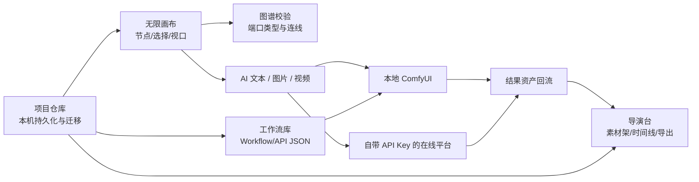
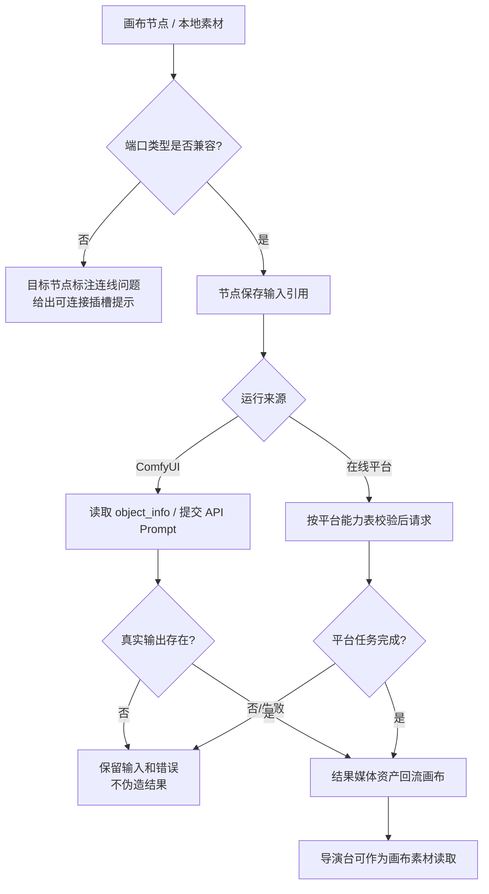
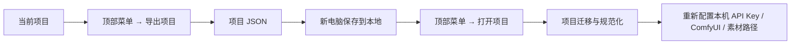
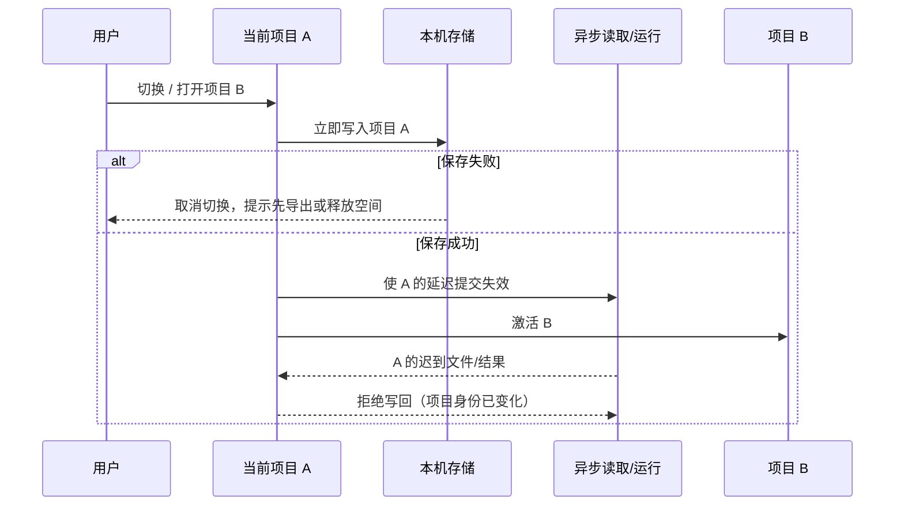
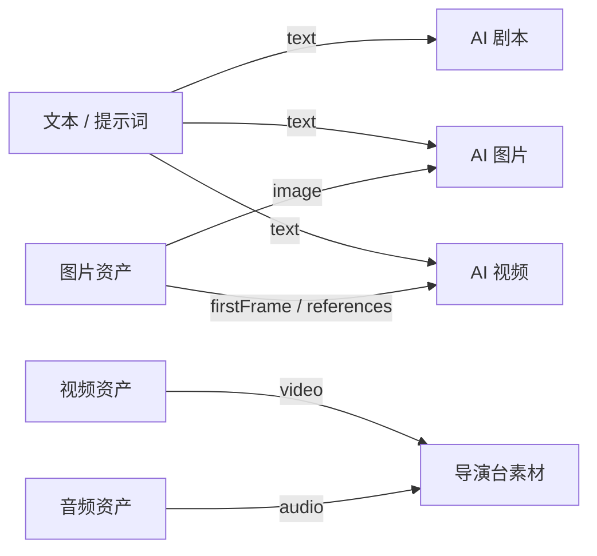
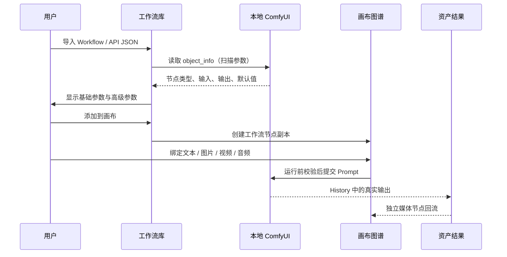

# 亿幕画布：当前操作、验收与交接指南

> 适用仓库：`D:\Codex\ComfyCanvas-workspace`
> 状态：重构开发版操作基线（2026-08-19）
> 读者：产品负责人、测试人员、下一位开发者
> 配套文档：[产品重构与验收基线](./产品重构与验收.md)

这份指南只描述当前代码中已有依据的能力，并把“能运行”“需要真实环境核验”“暂未具备”分开。它不把界面、模型列表或模拟余额当成真实服务承诺。

### 2026-08-19 真实桌面验收结论

本轮使用隔离的 Tauri 桌面验收配置完成了本机持久化与恢复核验；以下是实际观察结果，不是由单元测试推断的结论：

| 验收项 | 实际输入 / 操作 | 结果 |
| --- | --- | --- |
| 受管素材写入 | 小图 `26,458 B`、大图 `6,220,854 B`、MP4 `901,652 B`、WAV `264,678 B` | 四个文件均写入当前项目的 `workspace-v1/projects/<项目 ID>/assets` 受管目录；项目状态保存引用而不是整份媒体 `data:` |
| Windows 写盘兼容 | 在 Windows 上提交已写完的只读目标文件 | 验收发现 `sync_all` 返回 `os error 5`；已修复提交顺序，先同步再设置只读，随后四类素材均可正常提交 |
| 桌面重启恢复 | 完全退出验收程序后重新启动 | 图片元素 `naturalWidth > 0`；视频和音频 `readyState = 4` 且媒体元素无错误 |
| 视频交互 | 重启后播放、暂停并检查循环属性 | `loop = false`，可正常暂停，不再强制循环 |
| 导演台独立素材 | 从导演台直接导入素材，退出并重启 | 素材架中的独立素材恢复，未依赖画布节点临时状态 |
| 错误项目导入 | 从“打开项目”入口选择 ComfyUI 编辑器 UI JSON | 文件被明确拒绝，当前项目没有被替换或改写 |
| 旧媒体迁移副本 | 对正式备份副本执行显式迁移并重启 | 项目序列化内容由 `1,806,067` 个字符降至 `13,359` 个字符，重启后素材恢复 |
| 正式项目迁移 | 在已有备份后执行显式迁移 | 正式项目已升级为 schema `v2`；当前序列化内容 `13,337` 个字符，扫描不到 `data:` 媒体内容 |
| 项目历史迁移 | 正式项目存在一个旧历史项目时重启并自动保存 | 当前项目与旧历史项目分别写入独立 v2 文档；索引可读后才移除两个旧键，旧历史没有因清理丢失 |
| API 导入格式保护 | 在“导入 API 工作流”选择 ComfyUI 编辑器 UI JSON | 不添加 API 节点，当前节点数保持不变，并提示先导出 API 格式或到工作流库转换 |

正式项目迁移前的原始备份保持不变：

- 路径：`D:\Codex\ComfyCanvas-backups\深夜剧场-第三幕-20260819-100814.json`
- SHA-256：`16450B50751283767AA807CC15B2858DD939B2C4682C87154831947C65611138`

> 尚未执行：使用真实 ComfyUI 服务和真实在线平台 API Key 的端到端生成、轮询、计费、取消及输出回流。因此本次通过证明的是桌面素材、项目迁移和重启恢复链路，不代表 ComfyUI 或云平台生成已经通过真实账户验收。

## 1. 先读这张状态图

| 标记 | 含义 | 交付含义 |
| --- | --- | --- |
| ✅ 已实现并有代码/单元测试依据 | 逻辑已存在，仍应在本机界面复验 | 可以作为回归对象，不能跳过环境测试 |
| ⚠️ 需真实环境核验 | 代码会请求本机 ComfyUI 或外部 API | 只有用真实密钥、真实工作流跑通后，才能称为可用 |
| 🟡 受限实现 / 开发中 | 只支持列明的参数或部分流程 | UI 必须保持限制，不能宣传成通用能力 |
| ⛔ 不提供 / 不可承诺 | 演示或不存在的服务 | 不得用它生产、收费或承诺跨电脑恢复 |

当前版本不是“所有模块都完成”的正式成品；它是已开始按模块化原则稳定化的开发版本。每次改动后，至少要跑第 10 节的构建和回归清单，才可以继续下一项。



## 2. 开发与运行边界

### 2.1 三种运行方式不能混用

| 场景 | 正确方式 | 说明 |
| --- | --- | --- |
| 日常开发 | `npm.cmd run tauri -- dev` | 会启动 Vite 和 Tauri；适合正在修改源码时使用 |
| 仅检查前端 | `npm.cmd run build` | 执行 TypeScript 检查和 Vite 构建，不启动桌面窗口 |
| 发行安装包 | `npm.cmd run tauri -- build` | 仅在功能验收完成后构建；构建过程不等于功能验收 |

不要双击调试目录中的 EXE 来判断程序是否正常。调试 EXE 可能指向 Vite 的 `127.0.0.1:1430`；若 Vite 未启动，浏览器/窗口出现“拒绝连接”是预期故障，不是画布数据丢失。

### 2.2 外部依赖

| 依赖 | 用途 | 项目是否自带 | 正确检查方式 |
| --- | --- | --- | --- |
| Node.js | 前端依赖、Vite、测试 | 否 | `node -v`、`npm -v` |
| Rust + Windows C++ 构建工具 | Tauri/Rust 桌面端 | 否 | `cargo -V`、`cargo check --locked` |
| 本地 ComfyUI | 本地工作流运行 | 否 | 在 ComfyUI 内启动服务，应用中点“检测连接” |
| FFmpeg | 导演台视频导出 / WebM 转码 | 否 | 在程序旁、`resources`、`PATH` 或 `YM_FFMPEG_PATH` 中可找到 |
| 在线平台 API Key | 在线文/图/视频请求 | 否 | 在“在线服务配置”保存后先点“测试连接” |

> 安全边界：自带 API Key 只保存在当前电脑本地配置中，不应写入 Git、项目导出文件、截图或聊天记录。可灵的 Access Key / Secret Key 也不得提交到仓库。

## 3. 当前模块与责任边界

下表既是操作地图，也是后续改代码时的“不得跨界”约束。

| 模块 | 当前入口 / 文件边界 | 负责什么 | 不应直接负责什么 | 当前状态 |
| --- | --- | --- | --- | --- |
| 项目仓库 | `src/core/project/*` | 项目 index、文档、本机保存、迁移、导入前可携带性清单、项目命令 | API 调用、UI 样式、时间线算法 | ✅（本机桌面迁移/重启已验收；跨电脑仍需验证） |
| 图谱与端口 | `src/core/graph/*`、`src/core/nodes/builtins/*` | text/image/video/audio/latent 等端口、兼容判断、旧连线升级 | React 事件、平台请求 | ✅ |
| 异步运行所有权 | `src/core/execution/runRegistry.ts` | 为每个“项目 + 节点 + 本次运行”发放 token，阻止旧结果覆盖新运行 | 直接渲染卡片、决定平台协议 | ✅（真实远端取消仍需 E2E） |
| 节点能力表 | `src/core/providers/imageCapabilities.ts`、`videoCapabilities.ts` | 模型支持的模式、图数、尺寸、质量等限制 | 真实扣费、万能模型推断 | ✅ / 🟡 |
| 画布应用层 | `src/App.tsx` | 节点交互、项目/工作流/在线生成 UI 的编排 | 成为所有业务逻辑唯一入口 | 🟡，仍需继续拆分 |
| 桌面受管素材仓储 | `src/core/assets/workspaceAssetClient.ts`、`src-tauri/src/main.rs` | 将桌面版导入的二进制素材分块写入应用专属 AppLocalData，并保存小型引用描述 | 云同步、跨电脑拷贝、浏览器版大文件持久化 | ✅ 代码/单元测试/真实 Tauri 写入与重启恢复；⚠️ 跨设备仍需验收 |
| Comfy 工作流库 | `src/WorkflowLibrary.tsx`、`src/ComfyWorkflowParameters.ts` | 导入、扫描、转换、公开参数、加到画布 | 替用户补齐缺失模型 | ✅ / ⚠️ |
| 在线 Adapter | `src-tauri/src/main.rs` | OpenAI/Gemini/万相/可灵/豆包等请求和轮询 | 伪造平台能力、代管用户密钥 | 🟡 / ⚠️ |
| 导演台 | `src/DirectorMode.tsx`、`src/core/director/*` | 素材架、预览、时间线、导出、保存失败恢复 | 读取生成节点私有 state | 🟡 |
| 积分 | `src/CloudPointsCenter.tsx` | 演示余额/账本交互 | 真实支付、扣费、退款 | ⛔ 演示版 |

### 3.1 数据流与失败边界



## 4. 项目管理、保存与迁移

### 4.1 新建与日常保存

1. 从顶部菜单选择“新建项目”。系统会提醒当前画布会被替换；重要项目先导出。
2. 画布修改后会尝试保存到当前电脑的本机项目存储。
3. 顶部状态显示“已离线保存”表示小型项目元数据已写入本机存储；这不是跨电脑备份，也不是云同步。
4. 出现“媒体较大：自动保存空间不足”时，立刻使用“导出项目”保存，不要只依赖浏览器存储。

当前持久化实现将项目索引和每个项目文档拆开保存，并对旧存储键进行迁移。`normalizeProject` 会清理损坏的分组、规范旧数据，并尝试给能够安全判断的旧连线补充端口 ID。无法安全判断的旧连线应保留并提示重新连接，而不是静默猜测。

本轮已补上“保存顺序”和“切换时机”的保护：活动项目文档会先写入，再更新小型项目索引；只有这两步成功后，才会清理超出保留上限的旧文档。若本机存储满、索引写入失败或当前项目无法被立即保存，程序会保留已有项目而不是先删除，并取消项目切换。项目切换会同步使旧项目的延迟保存失效，避免上一项目 450ms 自动保存定时器把新项目的活动指针覆盖掉。

关闭应用、浏览器开发页的刷新/关闭也会同步提交最后一帧拖动或缩放后再保存；标题栏 `×` 在保存失败时会取消关闭并提示先导出。仍建议重要素材项目主动导出：浏览器/系统强制结束进程时无法保证任何 WebView 都有机会执行关闭回调。

### 4.1.1 桌面受管素材仓储：适用范围与正确预期

在 **Tauri 桌面版** 中，从画布导入的图片、视频、音频、AI 参考图，以及导演台直接导入的外部媒体，会走受管素材仓储，而不是把整份二进制编码成大 `data:` 字符串写入项目存储。Rust 端只允许写入应用自己的 `app_local_data_dir()/workspace-v1/projects/<项目 ID>/assets` 目录；前端不能指定任意硬盘目标路径。

| 项目 | 当前实现 | 不能据此承诺的事 |
| --- | --- | --- |
| 写入方式 | 前端按 1 MiB 分块上传；桌面端逐块校验、临时写入并在提交时原子落盘 | 这不等于网络上传、云备份或跨电脑同步 |
| 单文件边界 | 桌面端拒绝超过 1 GiB 的单个素材；单个 IPC 分块受 16 MiB 上限保护 | 不代表任意大小、任意编码的媒体均可被预览或导出 |
| 项目内保存 | 项目 JSON 保存素材 ID、文件名、MIME、尺寸/时长及本机路径/预览引用；不应保存完整文件字节 | JSON 本身不是素材包；复制 JSON 不会复制 AppLocalData 中的二进制文件 |
| 失败处理 | 上传中失败会尝试取消临时上传；桌面端没有可渲染的本机路径时不应假装素材已导入 | 这不能替代断电、磁盘损坏、杀进程等真实异常恢复验证 |
| 本机清理 | 删除新上传但最终未挂接的孤儿素材；删除已挂接素材前会检查项目引用；旧 `data:` 媒体可由用户显式触发迁移 | 这不是完整的磁盘回收站或跨项目垃圾收集；不要手动删除仍被引用的 `workspace-v1` 文件 |

**浏览器/Vite 预览不是桌面素材仓储。** 普通画布和 AI 参考图在浏览器预览模式下仅允许不超过 **4 MiB** 的文件转换为 `data:` 预览；更大的文件应直接提示使用桌面版。这个回退路径仍会受浏览器/WebView 配额影响，不能作为大媒体持久化方案。导演台在浏览器模式直接导入的外部媒体则是**仅本次会话**：关闭或刷新后必须重新导入。

**旧项目不会在打开时自动搬运。** 桌面版会在项目菜单显示“迁移旧媒体到本机素材仓库（N）”；只有用户显式触发后，程序才逐项把可解码的旧 `data:` 媒体写入受管目录，并且仅在单项写入成功后替换引用。失败项保留原值以便重试；`blob:`、丢失的本机原文件和无法解码的内容仍需重新导入。执行前必须先导出项目备份。

### 4.2 导出、打开与跨电脑迁移



导出的项目用于保存画布结构、节点参数、连线、工作流/提示词等项目数据。以下项目**不能假设会自动完整迁移**：

- ⛔ 当前电脑的 API Key、Secret Key、访问 Token 和账户登录态；导出时会自动剔除，新电脑必须重新配置。
- ⚠️ 仅内存中的 `data:` / `blob:` 导演台导入素材；刷新或重启后程序会提示重新导入，而不会伪装为已保存。
- ⚠️ 当前电脑 AppLocalData 受管素材和任何绝对本机路径；导出 JSON 不携带其二进制文件，换电脑后必须重新导入/重新绑定。
- ⛔ 本项目目前不是云同步和团队协作产品，导出 JSON 也不是素材云盘。

“打开项目”只接受亿幕画布项目包或符合旧版画布节点合同的 JSON。ComfyUI **编辑器界面**导出的 JSON 也会包含 `nodes`，但并不是画布项目；程序会明确拒绝它。请在 ComfyUI 使用“保存（API 格式）”得到 API Prompt JSON，再到工作流库/“导入 API 工作流”中导入。

### 4.3 导入前的可携带性清单

`src/core/project/portability.ts` 提供纯函数 `analyzeProjectPortability(package)` 和
`createProjectPortabilityManifest(package)`。现在导出会随项目 JSON 写入只读的可携带性快照；打开项目时会**重新扫描真实 JSON**、在写入本机存储前列出前三个具体问题并要求确认。它不复制文件、不探测磁盘，也不会把猜测结果当作已恢复：

| 状态 | 含义 | 典型来源 | 用户动作 |
| --- | --- | --- | --- |
| `portable` | JSON 中已有可引用内容，或使用跨设备远程 URL | 画布节点内嵌 `data:`、`https:` 素材、随包保存的有效工作流/提示词 | 可继续；远程 URL 仍取决于网络和访问权限 |
| `requiresRebind` | 文件描述存在，但换电脑后无法直接取得原文件 | `C:\...`、`file:`、`asset:`、`tauri:`、AppLocalData 受管素材引用、`blob:`、导演台会话素材 | 导入后重新选择/绑定原素材或重新选择工作流 |
| `missing` | 引用目标或必要内容根本不在项目包中 | 找不到的工作流 ID、缺失画布参考、损坏工作流 JSON、断开的导演台时间线片段 | 修复项目包或在新电脑补回素材/工作流后再运行 |

特别说明：画布节点中**实际完整写入项目 JSON 的** `data:` 可以随 JSON 迁移，但这只适用于旧的小型内嵌内容，不能当作大媒体方案；导演台的外部 `data:`/`blob:` 是会话素材，按设计一律列为 `requiresRebind`。桌面受管素材的实际文件位于当前电脑 AppLocalData，项目包仅保存引用，也一律不能宣称可跨电脑恢复。工作流引用会同时核对节点的 `comfyWorkflowId` 与项目包内的 `comfyWorkflows`；提示词库会检查数组和文本条目是否有效。

### 4.4 切换、导入与异步读取保护

项目切换、拖入导入和 FileReader 都可能在用户动作之后才完成。当前实现会把“发起时的项目 ID”记录下来；等文件读取/元数据读取结束时，只有目标项目和目标节点仍存在，才会写回结果。若中途新建、打开、切换或删除了目标，程序应显示“已取消导入”，而不是把旧文件错误写入新项目。



### 4.5 项目管理验收

| 用例 | 操作 | 期望结果 | 失败判定 |
| --- | --- | --- | --- |
| 新建项目 | 新建后确认 | 得到默认项目，旧画布不再显示 | 没确认也丢失旧项目 |
| 自动保存 | 新建一个文本节点，等待保存状态 | 刷新后节点仍存在 | 状态显示已保存但刷新丢失 |
| 保存失败时切换 | 人为让本机存储写入失败后尝试打开历史项目 | 不切换，提示先导出或清理空间 | 静默切换并丢失当前修改 |
| 延迟读取 | 开始导入大文件后立刻切换/新建项目 | 提示已取消导入，文件不写入新项目 | 旧文件出现在错误项目或错误节点 |
| 导出/打开 | 导出 JSON，在同机新项目打开 | 节点、分组、可解析连线恢复 | 文件损坏或静默丢节点 |
| 旧数据 | 打开旧项目 | 可迁移的旧连线补端口；不确定者提示重连 | 将不确定连线强行接错 |
| 桌面大媒体 | 在 Tauri 桌面版导入一个大于 4 MiB、但小于 1 GiB 的媒体 | 项目只保存小型引用，关闭并重开后仍能在本机预览 | 变成巨大 `data:` 项目内容、重开后假装可用或导入后无可读错误 |
| 浏览器大媒体 | 在 Vite/浏览器预览导入大于 4 MiB 的媒体 | 拒绝并提示改用桌面版，不写入半个节点 | 静默压入浏览器存储或显示“已保存” |

## 5. 画布：添加节点、移动、连线与结果回流

### 5.1 添加节点

可以通过左侧创建区、节点菜单/右键菜单或工作流库“添加到画布”创建节点。常用类型包括：文本/提示词、脚本/分镜、图片、视频、音频、AI 剧本、AI 图片、AI 视频、Comfy 工作流。

操作规则：

1. 用节点标题/空白控制区拖动节点；媒体内容区优先处理预览、播放与暂停，不能抢走画布拖动。
2. 文本输入区域获得焦点时，应只编辑文本，不移动节点或画布。
3. 画布空白处拖动用于平移；滚轮/触控板缩放应围绕当前指针。
4. 生成结果应新增为独立图片/视频/音频资产节点，而不是只把缩略图塞进生成器卡片。

### 5.2 连线是真实数据依赖，不是装饰线

当前图谱核心已定义 `text`、`image`、`video`、`audio`、`latent`、`workflow`、`any` 等端口类型。创建连线时会校验：

- 节点是否存在；
- 指定端口是否存在；
- 是否把节点连到自身；
- 输入/输出类型是否一致；
- 单输入端口是否已经被占用；
- 是否重复连线；
- 是否形成环路。



如果 UI 反馈“连线：不能把 X 输出连接到 Y 输入”或“输入插槽只能连接一次”，这是有效的保护，不应删除校验来让线画出来。正确处理是：更换目标节点、选择兼容的插槽，或先断开旧连接。旧项目中端口身份不明确的连接需要手动重新连，而不是让迁移擅自改变语义。

### 5.3 画布验收

| 用例 | 步骤 | 期望 |
| --- | --- | --- |
| 文本→图片 | 添加文本与 AI 图片，拖线 | 生成 `text` → 提示词类输入的连线 |
| 图片→视频 | 添加图片与 AI 视频，按模式选择首帧/参考图 | 链接绑定到明确的图像插槽 |
| 非法类型 | 把音频拖到图片输入 | 连线不写入项目，目标有可读原因 |
| 重复/环路 | 对同端口重复连，或下游连回上游 | 被拒绝，不破坏已有图 |
| 移动后撤销 | 拖动节点一次并撤销 | 一次拖动只形成一次撤销记录 |
| 刷新恢复 | 完成上述动作后刷新 | 已保存的节点/连线仍可加载 |

> ⚠️ 大画布性能、完整框选/小地图/对齐和所有媒体交互仍需专门 E2E 验收；不能只因为单元测试通过就称为完全稳定。

### 5.4 运行 token、停止与重跑保护

异步生成不能只凭“节点仍然显示 loading”判断哪个结果有权写回。当前 `RunRegistry` 为每一次运行生成唯一 token：`projectId + nodeId + runId`。在真正写入图片、视频、文本或错误状态的最后一步，应用会再次确认该 token 仍是当前可提交的运行。

| 情况 | 当前保护 | 不应该发生的结果 |
| --- | --- | --- |
| 同一节点再次运行 | 新 runId 立刻替换旧 runId | 较慢的旧请求覆盖较快的新结果 |
| 切换/导入/替换项目 | 旧项目所有运行被标记为失效 | 项目 A 的结果突然写进项目 B |
| 删除正在运行的节点 | 该节点的运行 token 被取消 | 迟到结果创建孤儿节点或复活已删除节点 |
| 点“停止”后 | token 进入终止状态；延迟 UI 定时器不会重新授予写权限 | 旧停止请求误停重跑任务，或停止后旧结果仍写回 |
| 远端服务晚返回 | `canCommit` 失败时丢弃晚到结果 | 旧结果改变当前画布/状态 |

这解决的是**客户端状态归属**，不是对所有外部服务都提供可靠取消：例如 ComfyUI `/interrupt` 有全局影响，云服务可能已开始计费或不提供取消端点。因此停止后仍应在真实 ComfyUI 和真实云端任务上核验“服务端是否停止、是否产生费用、UI 是否不回写旧结果”。

当前版本不会把 ComfyUI `promptId` 或云端任务 ID 作为“可恢复队列”跨应用重启保存。因此任务运行中请不要关闭应用；若必须关闭，请到 ComfyUI 输出目录或平台控制台取回完成文件，再作为素材导回画布。跨重启的任务恢复轮询属于下一阶段，不应被误认为已经完成。

## 6. AI 文本、AI 图片、AI 视频

### 6.1 AI 文本 / 剧本

基础创作页应仅使用：文本提示词、引用图片、模型预设、篇幅/格式、语言、创意强度等。复杂采样、私有平台选项或工作流节点参数不应泄漏到普通创作 UI。

图片参考应通过图片资产或 `@图片` 引用建立依赖；对于支持识别的文本流程，识别结果是建议文本，用户应能选择/复制后写入，而非静默替换原提示词。

| 状态 | 说明 |
| --- | --- |
| ✅ | 文本节点和图片参考端口的类型定义存在；提示词库可保存本机常用词条 |
| ⚠️ | OpenAI / Ollama / 兼容文本服务的真实成功取决于本机端点与密钥 |
| 🟡 | 不同模型支持的图像理解、结构化剧本输出并非自动通用，需按 Adapter 核验 |

### 6.2 AI 图片：能力表先于参数表

图片页面不能先让用户选参数、再由请求端悄悄忽略。当前能力表会把 UI 限制在已实现 Adapter 能传递的范围内；请求提交前还会规范化旧节点遗留的比例、分辨率、数量和质量，并拒绝没有对应 API 尺寸的组合。

| 平台/模型族 | 当前已暴露能力 | 明确限制 |
| --- | --- | --- |
| OpenAI `gpt-image-*` | 文生图、单参考图编辑；1:1 / 3:2 / 2:3；1024/1536；质量 auto/low/medium/high | 当前单请求只返回 1 张 |
| OpenAI DALL·E 3 | 文生图；1:1 / 横向 / 纵向 API 尺寸；standard/hd | 不支持参考图编辑 |
| OpenAI DALL·E 2 | 方形图与单图编辑 | 不要把 DALL·E 3 的尺寸/质量暴露给它 |
| Google Nano Banana / Gemini | 文生图及最多 14 张参考图；比例由模型能力约束 | Lite/旧版固定 1K；真实模型权限需连接测试 |
| Midjourney | 生成官方 `/imagine` 手动命令 | ⛔ 不执行 Discord 自动化，也不承诺 App 内直接出图 |

操作：选择“自带 API Key” → 选择平台与模型 → UI 自动收窄模式、比例、尺寸、数量、质量 → 添加参考图（如该模型支持） → 生成。若选项被自动改回，是为了阻止旧节点遗留的非法配置继续发送。

### 6.3 AI 视频：平台、模型、模式必须同时匹配

视频能力表只暴露当前桌面 Adapter 可以完整传给服务商的组合；它宁可少显示，也不能显示后静默丢参考图。提交前会再次核对模式、生成数量、图片数量和模型能力；切换平台或模型时，界面会自动换到当前模型允许的模式/数量。

| 平台/模型条件 | 支持模式（当前适配） | 图片数量规则 | 备注 |
| --- | --- | --- | --- |
| 阿里百炼·万相 | 文生、图生或首尾帧，取决于模型 ID | 文生 0；图生 1；首尾帧 2 | `kf2v` / `i2v` 等模型能力会被区分 |
| 可灵 Kling `kling-v1-6` | 文生、图生、首尾帧 | 文生 0；图生 1；首尾帧 2 | 请求会使用 `image` / `image_tail` 合同 |
| 可灵其他已知模型 | 文生、图生 | 依具体模型而定，当前保守限制 | 未验证型号不会假设支持首尾帧 |
| 豆包 Seedance 2.0 | 文生、图生、首尾帧、多参考 | 多参考最多 9 张 | 使用内容角色合同；必须用真实账号核验 |
| 豆包 Seedance 1.0 Lite I2V | 图生、首尾帧、多参考 | 多参考最多 4 张 | 不自动宣称文生能力 |
| 豆包 Pro 系列 | 文生、图生、首尾帧（仅已列型号） | 文生 0；图生 1；首尾帧 2 | `pro-fast` 不从同族推断能力 |

所有当前在线 Adapter 一次只返回一个视频。生成数量 UI 若被限制为 1 是真实限制，不是遗漏；要支持批量，必须实现重复提交、并发上限、取消、成本和结果聚合，不能先把 2/4 个按钮放出来。

#### 当前真实请求合同（代码适配）与 E2E 边界

| Adapter | 当前已接入的请求映射 | 已在代码中做的保护 | 仍必须用真实账户核验 |
| --- | --- | --- | --- |
| OpenAI 图片 | 文生图/单图编辑，并把模型可接受的 `size`、`quality` 传给桌面命令 | DALL·E / GPT Image 的尺寸、参考图与质量被能力表限制 | 账号权限、模型可用性、响应格式、费用和结果回流 |
| Google Nano Banana | Gemini 图片请求，按模型限制分辨率和参考图数量 | Lite/旧模型锁 1K；最多 14 图参考不作为所有模型的通用承诺 | API Key 权限、区域、返回媒体和多图真实效果 |
| 阿里百炼·万相 | DashScope 视频请求；模型 ID 区分文生/图生/首尾帧 | 文生 0 图、图生 1 图、首尾帧 2 图的提交前校验 | 已开通模型、实际参数名、异步轮询、视频回流 |
| 可灵 Kling | AK/SK 生成短期 JWT；`image` / `image_tail` 映射图生/首尾帧 | 未验证型号保持保守能力，`kling-v1-6` 才开放首尾帧 | 凭据方式、模型开通、任务轮询、取消语义和计费 |
| 豆包·火山方舟 | Seedance 内容角色映射，按型号支持文生/图生/首尾帧/多参考 | Seedance 2.0 最多 9 图；Lite I2V 最多 4 图；不从型号名称推断 `pro-fast` | 接入点 ID、图片角色协议、任务状态、视频 URL 与费用 |

上表是“请求字段不会被客户端故意丢掉”的代码级说明，不是供应商 SLA，也不是已经真实生成成功的证明。

#### 视频运行步骤

1. 添加 AI 视频节点，并把文本/图片通过兼容端口接入；或在节点中添加对应参考。
2. 选择“本地 ComfyUI”或“自带 API Key”。云端积分入口不能用于真实任务。
3. 选平台、模型；模型变化后确认模式是否被自动调整。
4. 选择模式：文生不加图；图生需要 1 张；首尾帧需要恰好 2 张；多参考必须在模型允许的数量内。
5. 运行前阅读节点提示；缺图/模式不匹配时先修复，不要强行提交。
6. 成功后检查是否出现独立视频资产；再拖入导演台。

## 7. ComfyUI 工作流库与本地执行

### 7.1 工作流库用途

工作流库是 ComfyUI 工作流的项目内管理区。它支持导入、保存、扫描、加到画布和双格式导出：

| 操作 | 支持内容 | 真实含义 |
| --- | --- | --- |
| 导入 JSON | ComfyUI Workflow JSON、API Prompt JSON | 识别格式后保存到本机工作流库 |
| 扫描接口 | 已连接的 ComfyUI `/object_info` | 识别真实输入/输出、可公开参数；运行时仍会再读当前接口 |
| 添加到画布 | API 内容或已转换内容 | 生成可运行的工作流节点副本 |
| 导出 Workflow | Workflow JSON | 用于 ComfyUI 可视工作流场景 |
| 导出 API | API Prompt JSON | 用于程序提交、自动化或 API 工作流场景 |

### 7.2 推荐操作步骤



1. 先在 ComfyUI 中确认 workflow 可独立运行；本应用不会替用户下载模型或自定义节点。
2. 在应用顶部菜单打开“工作流库”，点“导入 JSON”。
3. 选中工作流后点“扫描接口”。扫描提示“未读取到节点定义”时，说明 ComfyUI 未连接/接口不可读；可保存结构，但不要假设参数完整。
4. 确认创作页公开的是提示词、参考图、尺寸、时长、模型等基础控制；采样器、CFG、Seed、VAE 等到工作流库/高级参数管理。
5. 点“添加到画布”，再对该节点绑定图谱输入；运行时使用节点副本，不直接修改库里原始模板。
6. 如出现缺模型、缺节点、必填输入或没有真正输出，按错误定位 ComfyUI 内相应节点/插槽，修复后重新扫描。

### 7.3 ComfyUI 已知边界

- ✅ 默认值存在的 Comfy 控件不能一律被当作“缺失必填输入”；扫描逻辑和测试覆盖了这类情形。
- ✅ 媒体绑定、预览输出识别、真实输出优先级已有实现与测试基础。
- ⚠️ 非标准自定义节点、子图、特殊视频/音频链必须用实际 workflow 回归；不能按节点名称猜测。
- ⚠️ 工作流更新、节点 ID 变化后必须重新扫描接口；不要硬编码旧节点 ID。
- 🟡 视频帧、VAE 解码、VHS 合成、音频解码的自动连线会以真实端口类型为准；若接口信息不足，应报出需人工连接的插槽，而不是自动接错。

## 8. 在线 API：配置、适配与真实测试

### 8.1 为什么没有“万能接口”

不同平台的认证、模型 ID、异步任务、图片上传、视频参考帧、音频、回调、错误码和计费都不同。一个“通用 URL + Key”只能覆盖 OpenAI 兼容文本/图片等有限协议，不能安全地让可灵、豆包、万相、ComfyUI 自动互通。

因此正确结构是：**统一的画布请求模型 + 每平台独立 Adapter + 明确能力表**。新增平台需要适配其真实文档、请求合同、任务轮询、输入限制、错误映射和真实账号测试，而不是只把平台名字加进下拉菜单。

### 8.2 已有适配入口

| 平台 | 当前用途 | 配置 | 测试说明 |
| --- | --- | --- | --- |
| OpenAI | 文本、图片 | API Key / 兼容端点 | 先测试密钥；图片尺寸/质量由模型能力表限制 |
| Ollama | 本地文本 | 本地服务 | 读取本机已安装模型，不创建任务 |
| Google Nano Banana | 图片 | Gemini API Key | 读取权限/模型；不创建图片任务 |
| 阿里百炼·万相 | 视频、提示词相关能力 | DashScope API Key | 需账号/模型开通后真实跑一条任务 |
| 可灵 Kling | 视频 | Access Key + Secret Key，或配置支持的单 Key 方式 | 测试读取任务/生成签名，不创建视频 |
| 豆包·火山方舟 | 视频 | API Key + 已开通的模型/接入点 ID | 需要真实模型权限验证 |

### 8.3 配置与测试顺序

1. 打开“在线服务配置”，选择平台。
2. 填写必需凭据。可灵 AK/SK 方式需要两个字段；豆包需要真实已开通的模型/接入点。
3. 先点“测试连接”或“自动读取并识别模型”。**测试成功只说明认证/读取权限通过，不等于一次生成必定成功。**
4. 点击“保存本机配置”，再回到对应 AI 节点选择平台和模型。
5. 用最小请求做真实试跑：短文本、1 张合法图片、短时长。核对结果资产是否回流、错误是否可读。
6. 把验证过的模型/模式记录进项目测试表；未知模型保持保守能力，不要让 UI 推测。

### 8.4 真实 API 验收记录模板

每个平台至少保留一份不含密钥的记录：

| 日期 | 平台 | 模型/接入点 | 模式 | 输入 | 结果 | 任务 ID（可脱敏） | 错误/备注 |
| --- | --- | --- | --- | --- | --- | --- | --- |
| YYYY-MM-DD | 可灵 Kling | kling-v1-6 | 首尾帧 | 2 张合法图片 | 成功/失败 | `…` | 说明是否回流 MP4 |

不能以“页面下拉中有这个平台”“连接测试成功”替代这一条记录。

## 9. 导演台：素材、时间线和导出

### 9.1 当前结构与正确操作

导演台是独立工作区，不应因为素材架内容多而挤压预览监视器。布局目标为：左侧脚本/导演笔记，中央固定画幅预览，右侧独立滚动素材库，底部时间线。

1. 从画布顶部/工具区进入“导演模式”。
2. 右侧“独立素材库”中可看到画布结果；也可通过“导入”加入文件或文件夹。
3. 把图片、视频、音频拖到正确轨道；视频/图片进入视频轨，音频进入音频轨，字幕进入文本轨。
4. 使用播放/暂停、吸附、播放头、剪切、轨道开关、文本轨编辑完成基本编排。
5. 打开“导出”，选择导出目录和参数；若找不到 FFmpeg，不要继续尝试损坏导出，先安装/配置 FFmpeg。

### 9.2 当前保护逻辑

- 无素材时，时间线保留 5 秒空轨道；一旦有素材，项目时长取视频/音频/文本三条轨道中最晚结束的片段，避免只能拖到 5 秒。时间线坐标读取移动中的内容矩形，并在拖到两侧时自动横向滚动，避免滚动后出现错误落点。
- 素材架使用独立滚动容器；素材变多只滚动右侧列表，不能改变中央预览区域的尺寸。该边界已有 `core/director/layout` 的纯函数测试基础，仍需真实窗口拖入大量素材复验。
- 预览优先使用已读到的真实媒体宽高；对竖屏素材使用可预测的 9:16 舞台，并以 `contain` 保留原图，避免把 9:16 强行拉成横屏或裁切。实际播放首帧加载后会覆盖旧项目中失真的尺寸元数据。
- 在 Tauri 桌面版直接从导演台导入的外部媒体会写入受管素材仓储；持久化状态只记录 `assetId`、本机路径和元数据，预览时才转换为 WebView 可读地址，不把文件字节写进 localStorage。
- 浏览器模式或旧的 `data:` / `blob:` 导演台素材不会被偷偷持久化。它们只在当前会话可用；保存后若没有原始 `src`，界面必须提示“重新导入”，而不是显示假缩略图。旧 `data:` 素材也不会自动迁移到受管素材仓储。
- 轨道每种类型最多保留 5 条，防止 UI 无限挤压。

### 9.3 导演台验收

| 用例 | 操作 | 期望 |
| --- | --- | --- |
| 多素材滚动 | 导入 30+ 图片/视频 | 右侧独立滚动，中央预览尺寸不变 |
| 竖屏 | 将 9:16 图片/视频拖入 | 预览按竖屏比例显示，不变成横屏拉伸 |
| 空时间线 | 不放素材 | 显示约 5 秒空轨；不锁死后续拖放 |
| 非空时间线 | 放入 12 秒视频和 5 秒图片 | 总时长至少覆盖 12 秒，播放头同步 |
| 播放控制 | 空格或播放按钮 | 可播放/暂停，播放头更新且不会拖动画布/片段 |
| 桌面素材恢复 | 在 Tauri 桌面版导入图片、视频、音频各一份，放入时间线后退出并重开应用 | 素材架、预览与时间线能重新读取当前电脑的受管文件；项目 JSON 不含整份文件字节 |
| 浏览器会话素材恢复 | 在 Vite/浏览器预览直接导入导演台媒体后刷新 | 清晰提示需要重新导入；不能显示假缩略图或把它标为已永久保存 |
| 旧内嵌素材 | 打开含旧 `data:` 导演台素材的项目后保存、重开 | 旧素材不被静默复制；如原文件内容不可用，显示重新导入提示 |
| 导出 | 可用 FFmpeg 环境下导出 | 生成指定文件；失败时显示具体原因 |

## 10. 技术验收：每次修改后必须执行

在仓库根目录运行：

```powershell
npm.cmd run test
npm.cmd run build
Push-Location src-tauri
cargo check --locked
Pop-Location
```

这些命令当前覆盖的是单元测试、TypeScript/Vite 构建和 Rust 编译检查。它们**不是**真实 API / ComfyUI / 导演台 E2E 的替代品。每次涉及下列区域后，还要做人工回归：

| 修改区域 | 最少人工回归 |
| --- | --- |
| `src/core/graph/*`、节点目录 | 文本→图片、图片→视频、非法音频→图片、重复连线、旧项目打开 |
| `src/core/project/*` | 新建、刷新恢复、导出/打开、撤销、切项目 |
| `src/core/execution/runRegistry.ts` 或任意异步生成分支 | 同节点快速重跑、停止后晚返回、切项目后晚返回、删除运行中节点 |
| `src/core/assets/*`、`src-tauri/src/main.rs` 的受管素材命令、`App.tsx` 媒体导入 | 在真实 Tauri 窗口导入超过 4 MiB 的图片/视频/音频；切项目期间导入；重开后预览；导出 JSON 到干净环境后确认要求重新绑定 |
| `ComfyWorkflowParameters` / Rust Comfy 调用 | 导入 API JSON、扫描、绑定图片、真实输出回流、缺输入报错 |
| 视频能力表 / 在线 Adapter | 每个已声明平台至少一个最小真实请求；模式/图片数非法时不提交 |
| `DirectorMode` | 多素材独立滚动、9:16、空 5 秒/有素材后自动延长、拖动到时间线右侧、播放暂停、导出失败提示 |
| CSS / 主题 | 画布、弹窗、菜单、导演台、禁用/错误/hover/focus 都检查；不能只看首页 |

### 10.1 P0 发布前闸门

以下任何一项未通过，都不能称为“完整程序”或构建正式安装包：

- [ ] `npm.cmd run test`、`npm.cmd run build`、`cargo check --locked` 全部成功。
- [ ] 冷启动三次，项目内容不丢失；测试 EXE 时不是依赖未启动的 Vite 地址。
- [ ] 强类型连线可创建、非法连线被拒绝、旧连线迁移不改错语义。
- [ ] 一条真实 ComfyUI 图片或视频 workflow 输入→运行→输出回流通过。
- [ ] 至少一个已声明在线视频 Adapter 和一个图片 Adapter 用真实账户通过最小请求。
- [ ] 导演台多素材、9:16、播放/暂停、导出/无 FFmpeg 错误路径通过。
- [ ] 在真实 Tauri 桌面版完成受管素材验收：画布媒体、AI 参考图和导演台外部媒体分别导入；退出/重开后仍能在**同一电脑**读取；浏览器预览大于 4 MiB 时明确拒绝；导出的 JSON 在干净环境要求重新绑定而不假装包含二进制文件。
- [ ] 导出项目后在干净本机配置打开，显示正确的外部依赖/素材恢复提示。
- [ ] 所有失败路径可读、可恢复，未用静默吞错或“生成一个假结果”掩盖失败。

### 10.2 真实 Tauri 受管素材验收记录与后续复验步骤

2026-08-19 已在**隔离的 Tauri 桌面验收配置**中执行本节核心步骤：`26,458 B` PNG、`6,220,854 B` 图片、`901,652 B` MP4、`264,678 B` WAV 均写入受管目录；重启后图片可解码，视频/音频 `readyState = 4` 且无媒体错误；视频 `loop = false` 并可暂停；导演台独立素材恢复；错误的 ComfyUI UI JSON 从“打开项目”入口被拒且项目未变化。验收期间还暴露并修复了 Windows 对只读目标执行 `sync_all` 时的 `os error 5`。

后续修改受管素材、项目持久化或媒体控件后，必须在 **Tauri 桌面窗口**复跑以下步骤，不能在仅运行 Vite 的浏览器标签页中代替。执行前保留原始测试媒体；不要通过删除正式 AppLocalData 目录来制造“干净环境”，应使用独立测试应用数据目录。

1. 从仓库根目录运行 `npm.cmd run tauri -- dev`，确认打开的是桌面窗口，而不是 `http://127.0.0.1:1430` 的普通浏览器预览。
2. 新建测试项目，分别从画布导入一张图片、一个视频和一段音频；其中至少一个文件应大于 4 MiB、且小于 1 GiB。确认每个节点能预览，项目 JSON/本机存储没有出现整份超大 `data:` 内容。
3. 在 AI 文本、AI 图片或 AI 视频节点添加一张本机参考图；确认缩略图和 `@图片` 等引用仍能工作。若本机已有可运行的 ComfyUI，再将该素材连接到真实 `IMAGE` 输入并执行一次最小工作流，确认桌面路径能被上传，而不是只在 UI 中显示。
4. 进入导演台，直接导入至少一张图片和一个视频，拖入时间线；退出整个应用并重新启动，确认在**同一电脑**能恢复素材架、预览和已有片段。对浏览器预览重复导入时，预期行为是会话提示，而不是永久恢复。
5. 用一个较大的文件开始导入后立即切换项目或删除目标节点。等待导入结束，确认文件没有写入新项目/已删除节点，且界面给出取消或错误说明。
6. 导出此测试项目 JSON，在另一台电脑、另一个 Windows 用户或隔离测试配置中打开。预期是可携带性清单把受管本机素材列为需要重新绑定；不得把它们标成已随 JSON 迁移。随后用保留的原文件重新导入并验证可恢复。
7. 记录 Windows 版本、Tauri 运行方式、测试文件类型/大小、重启结果、ComfyUI 版本（如执行）、错误原文和日志位置。任一项失败时保留原文件和项目 JSON，再修复；不要用“重新打开后看起来正常”代替记录。

当前可以称为“已完成同一电脑上的真实桌面受管素材写入、媒体重启恢复和显式旧媒体迁移验收”。仍不能称为已完成跨电脑媒体迁移、真实 ComfyUI 媒体上传/输出回流或真实云平台 API 验收；这些项目必须在有对应服务和密钥时单独执行并记录。

## 11. 故障排查速查

| 现象 | 最可能原因 | 处理顺序 |
| --- | --- | --- |
| `127.0.0.1` 拒绝连接 | 双击了调试 EXE，或 Vite 没启动 | 关闭该窗口；从仓库执行 `npm.cmd run tauri -- dev` |
| 本地 ComfyUI 显示未连接 | 服务未启动、端口不在 8188/8189、网络被拦截 | 先在浏览器打开 ComfyUI；再在应用点“检测连接”；必要时设置 `YM_COMFYUI_PATH` 仅用于提示路径 |
| ComfyUI 运行后无图片/视频 | workflow 没有真正 SaveImage/SaveVideo/VHS 输出，或输出节点被禁用 | 在 ComfyUI 独立运行；检查输出节点和 History；重新扫描再运行 |
| 提示缺输入 / 类型不匹配 | 图片数量、端口类型或 workflow 插槽不匹配 | 阅读节点标红的“哪一根线/哪个插槽”；按目标端口要求重新连 |
| `Ollama Options.stop` 等默认控件报错 | 老 workflow / 老扫描结果 | 重新扫描 Comfy 接口；有默认值的控件不应人工补成字符串 |
| 选择模型后模式自动切换 | 旧配置与新模型能力不兼容 | 这是保护逻辑；按当前模型支持的模式重新选择输入 |
| 可灵/豆包“测试成功但生成失败” | 测试只验证鉴权/读取权限；模型未开通、参数/图片不合法、余额/区域限制 | 用最小请求；记录模型/模式；查看服务端返回的具体错误，不要改成假成功 |
| 云积分按钮有余额但没有任务 | 积分中心为演示版 | 不会真实扣费/充值/退款；选择自带 API Key 或等待服务端账本实现 |
| 浏览器预览导入大媒体失败 | 浏览器模式只允许最多 4 MiB 的媒体回退，不提供桌面受管仓储 | 使用 Tauri 桌面版导入；不要提高限制后把大 `data:` 写回项目 |
| 桌面重开后受管素材不可读 | AppLocalData 文件被移动/删除、磁盘或权限异常，或尚未完成真实桌面验收 | 保留原文件并重新导入；不要把本机路径当成跨电脑素材包 |
| 导演台刷新后素材丢失 | 浏览器直接导入的是会话素材，或旧 `data:` / `blob:` 素材未重新导入为受管素材 | 根据 UI 提示重新导入；导出项目和本机目录备份不能替代媒体资产管理 |
| 导演台不能导出 | 未找到 FFmpeg 或浏览器不支持所选编码 | 按第 2.2 节配置 FFmpeg；改用可用格式或检查错误详情 |
| 大媒体提示保存空间不足 | 浏览器/WebView 本机存储配额不足 | 立即“导出项目”，保留原素材文件；不要依赖自动保存 |
| 改了一个模块另一个模块坏了 | 跨模块直接修改、缺少回归 | 按第 3 节边界拆改；按第 10 节跑相关人工回归后才合并 |

## 12. 明确不可承诺事项

以下内容必须在 UI、产品文案和交接中明确，不得因“有按钮/有页面”误导：

1. **真实积分、充值、支付、冻结扣费、失败退款：未部署。** `CloudPointsCenter` 是本机演示数据；没有服务端账户、订单、验签、账本或退款能力。
2. **云端积分模式不能提交真实任务。** 当前应使用本地 ComfyUI 或自带 API Key；旧云积分节点会提示切换配置。
3. **跨电脑完整媒体迁移不是自动完成。** 项目 JSON 不携带账户密钥，也不携带当前电脑 AppLocalData 受管素材的二进制文件；本机路径、旧内嵌文件和会话 Data URL/Blob 都需要重新导入/绑定，除非未来另行实现可验证的素材包导出/导入。
4. **受管素材仓储不是云盘、备份或垃圾回收服务。** 当前没有跨设备同步、共享、引用计数删除、恢复站或自动迁移旧 Data URL 的承诺。不要在没有原文件备份的情况下手工清理应用的 `workspace-v1` 目录。
5. **Midjourney 不做非官方 Discord 自动化。** 仅生成合规的手动 `/imagine` 命令。
6. **不支持“只填任意 URL 和 Key 就自动适配所有平台”。** 平台接入必须有明确 Adapter、能力表和真实测试。
7. **未被能力表列出的模型模式不应在 UI 开放。** 模型同名/同系列不代表请求字段、输入数量和输出协议相同。
8. **正式安装包不是当前开发完成的证明。** 打包前必须通过第 10.1 节闸门。

## 13. 下一位开发者接手清单

1. 先读取本文件和 [产品重构与验收基线](./产品重构与验收.md)，再修改代码。
2. 执行第 10 节三个基础命令，记录当前通过/失败状态；不要跳过失败直接继续堆功能。
3. 检查 `git status`，把现有未提交改动视为用户工作，不能用 `reset --hard` 或覆盖。
4. 新功能先放入对应核心模块或 feature 包；不要继续将所有状态、Adapter 和 UI 塞进 `App.tsx`。
5. 新连线必须调用图谱校验；新模型必须先写能力表和测试，再暴露 UI。
6. 新工作流必须用真实 `/object_info` / `INPUT_TYPES` / `RETURN_TYPES` 校验，不按节点名字猜测输入输出。
7. 新的媒体持久化要使用稳定 `AssetRef`/文件策略；桌面媒体接入 `workspaceAssetClient`，不要把大 Data URL 静默写入 localStorage；任何迁移/清理能力都必须先有备份和真实 Tauri 验证。
8. 修改 Director Mode 后，至少跑第 9.3 节所有项；修改在线 Adapter 后，必须以真实但脱敏的测试记录验证。
9. 写清楚“已完成、需环境核验、开发中、不可承诺”，让产品和用户看到真实状态。
10. 只有当第 10.1 节所有项完成，才讨论正式安装包、积分收费或更大范围发布。

---

### 给产品负责人的一句话结论

当前最值得投入的不是继续堆平台和视觉特效，而是把已有的**项目保存、强类型连线、工作流真实输入输出、结果资产回流、导演台媒体恢复和真实 API 回归**逐条验实。做到这些，画布才是一个可信的创作工具；在此之前，积分和广泛商业化入口必须保持关闭或标注演示。
